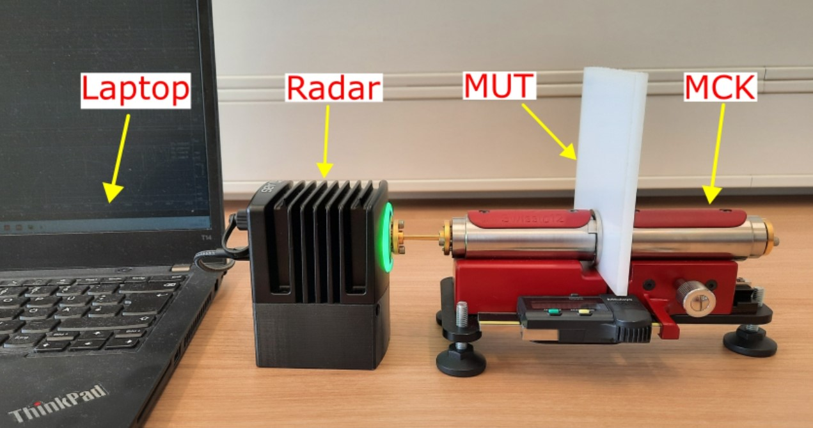
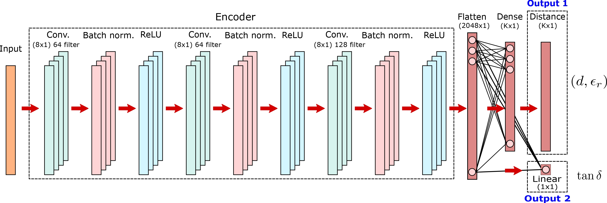
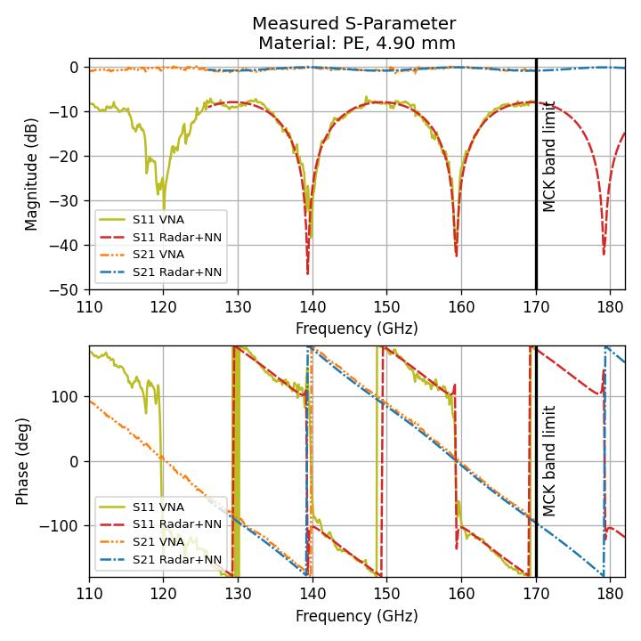

# **Deep Learning-Based Material Characterization Using FMCW Radar With Open-Set Recognition Technique**
This project leverages deep learning for the characterization of dielectric materials, employing FMCW radar measurements. It features a dataset generator and a deep learning model that utilizes the Class-Anchor-Clustering (CAC) loss function for precise estimation of material parameters, while also recognizing and rejecting unknown materials.

## Overview
###Radar Measurement Setup:
<br/>


###Architecture of the ML Model:
<br/>


###Magnitude and Phase of the S-Parameters:
<br/>


##Reference Paper
The code in this repository supports the findings of the following article:

**Deep Learning-Based Material Characterization Using FMCW Radar With Open-Set Recognition Technique**<br/>
*Salah Abouzaid, Timo Jaeschke, Simon Kueppers, Jan Barowski, Nils Pohl*<br/>
*Published in*: IEEE Transactions on Microwave Theory and Techniques, 2023<br/>
*DOI*: [10.1109/TMTT.2023.3276053](https://doi.org/10.1109/TMTT.2023.3276053)

## Citation
If you find this code useful for your research, please consider citing our paper:
```
@article{abouzaid2023deep,
  title={Deep Learning-Based Material Characterization Using {FMCW} Radar With Open-Set Recognition Technique},
  author={Abouzaid, Salah and Jaeschke, Timo and Kueppers, Simon and Barowski, Jan and Pohl, Nils},
  journal={IEEE Trans. Microw. Theory Techn.},
  year={May 2023},
  pages={1--11},
  doi={10.1109/TMTT.2023.3276053},
  publisher={IEEE}
}
```
##Getting Started
###Prerequisites
Install the necessary Python packages with:
```
pip install -r requirements.txt
```
## Dataset Generation
To generate the training dataset, navigate to the "datasets" directory and run the following scripts in the specified order:
```
python 01_InputToKmeans.py
python 02_KmeanClustering.py
python 04_TrainingDatasetGeneration.py
python 05_PreparingDatasetForPytorch.py
python 06_generate_trainval_splits.py
```
One method to split the classes is to run ```python 02_KmeanClustering.py``` again with ```K=600```, and then run ```python generate_class_splits.py``` to separate the classes.

## Training
The machine learning model can be trained with either an open-set classifier using CAC Loss or a closed-set classifier using Cross-Entropy (CE) Loss.
###Training an open set classifier with CAC Loss
```
python 01_train_openSet.py --model [MODEL]
```
###Training a closed set classifier with Cross-Entropy (CE) Loss
```
python 01_train_closedSet.py --model [MODEL]
```
In both the above commands, replace [MODEL] with 0 for Model-A and 1 for Model-B.

## Evaluation
We can evaluate the performance of our model trained with either an open-set classifier using CAC Loss or a closed-set classifier using Cross-Entropy (CE) Loss.
###Evaluating an open set classifier with CAC Loss
```
python 02_eval_openSet.py --model [MODEL]
```
###Evaluating a closed set classifier with Cross-Entropy (CE) Loss
```
python 02_eval_closedSet.py --model [MODEL]
```
In both the above commands, replace [MODEL] with 0 for Model-A and 1 for Model-B.
## Prediction
To predict the material parameters of a real measurement, we need first to calibrate the Material Under Test (MUT) using the SHORT and MATCH measurements.
###Calibrate the MUT:
Run the following script in the "measurements" directory:
```
python 00_calibrate_mut.py 
```
###Prediction using the open set classifier
```
python 03_mut_predict_openSet.py --model [MODEL]
```
###Prediction using the closed set classifier
```
python 03_mut_predict_closedSet.py --model [MODEL]
```
In the above prediction commands, replace [MODEL] with 0 for Model-A and 1 for Model-B.

Optional argument:```--none_thickness``` if the thickness is unknown.

## Acknowledgments
We extend our thanks to [Dimity Miller](https://github.com/dimitymiller/cac-openset#class-anchor-clustering-a-distance-based-loss-for-training-open-set-classifiers) whose CAC loss function code greatly facilitated this project.

## Contact
For any questions or comments, feel free to reach out to [Salah Abouzaid](mailto:salah.abouzaid@rub.de)


